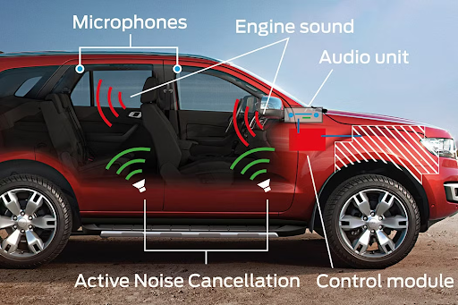
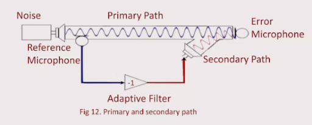
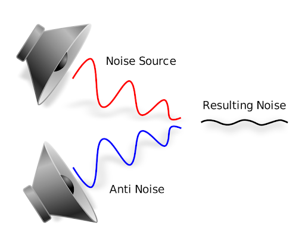
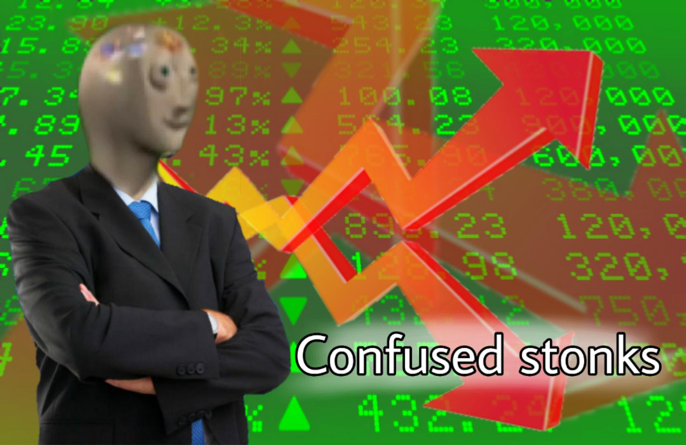
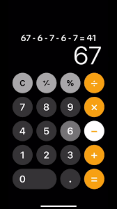
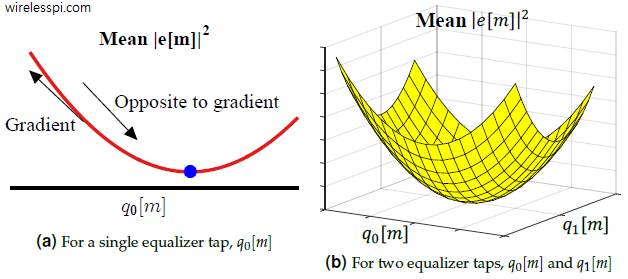
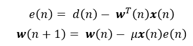
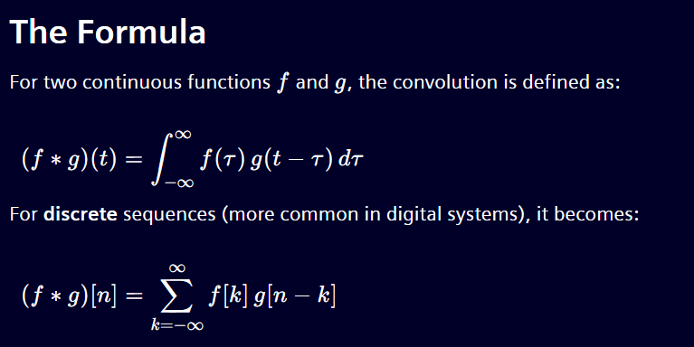
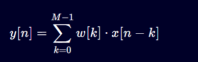

# ** Active Noise Cancellation 🔇 ** 

**work in progress**

---
## A brief background on Active Noise Cancellation (ANC): 

Over the past decade, many companies have developed practical applications to 
block out noise pollutions for different scenarios in everyday life. Whether 
it's specific to a system such as a car cabin

 

a cockpit in an aircraft

 

or usage for everyday life, like being in the office.

 

ANC is a technique that uses destructive interface to cancel out unwanted noise signals. It's specifically a **ADAPTIVE** learning algorithm that is employed to quickly learn the characteristics of the unwanted signal in real time. 

Below is a picture of the high level diagram on how ANC flows. 

 

Below is a picture of how ANC works 

 

You have a noise that you want to cancel out (red squiggly line) and you have a anti-noise that you generate from your system (blue squiggly line) 
When these two lines(sine waves) combines, their output should theoretically combine and make a new squiggly line(wave form) and that is our noise cancellation sound wave. 

Below is a visual representation of how they combine 

 

---

## Project Overview: 

### Table of Contents 📖 : 
* [LMS Background] (#LMS Background) 
* [LMS Math] LMS Math 
* [FxLMS vs LMS] FxLMS vs LMS 
* [FxLMS System Overview] FxLMS System Overview 
* [FxLMS Results] FxLMS Results 

This github is used as a personal documentation to help explain the math and usage of the 
Least Mean Squares(LMS) Algorithm used as well as later diving into different algorithms simulated in Matlab 2024A. 

This first portion will just be simulation in Matlab 2024A for post processing data. The noise generated will be 
simulated in Matlab as well. 

The second portion would be the attempt at the hardware for ANC, and will be linked at the top of the ReadMe file (if i get to it). 

Now lets dive into the fun. 

## LMS Background 

The Least Mean Squares algorithm is a widely used **adaptive** filter technique that updates filter coefficients iteratively to minimize the **MEAN SQUARE ERROR** between a desired signal and actual output. 

It specifically uses **STOCHASTIC GRADIENT DESCENT** method to efficiently adapt to real-time signals, making it ideal for this specific application. 

Stochoastic means that the results is randomly determined, aka having a random probability distribution pattern that is not able to be predicted precisely. Think of the stock market, weather patterns, and traffic congestions. 

 

The opposite of stochoastic is deterministic, meaning that every event, output, or action is strictly determined, leaving no room for chance or randomness. Think of calculators, traffic lights, etc. 

 

Below is the diagram depiction of the LMS gradient descent. 

 

The main equations that determines the LMS algorithm is:

 
**e(n)** is the error you are trying to minimize in your system, 

**w(n + 1)** is the weight update equation that adjusts better and gets closer after every sample/input.

you might see that e(n) = d(n) - y(n), and in this case, y(n) = $w^T$(n)*x(n)

so basically, e(n) = d(n) - y(n) = d(n) - $w^T$(n)*x(n)

### Quick before background again for the variables in this: 
-**e(n)** = error signal you are trying to minimize 

-**d(n)** = the noise you are wanting to cancel out 

-**y(n)** or $w^T$(n)*x(n) = the anti-noise you are trying to generate to cancel out d(n)

-**u** = the learning rate you give to the system 

**$w^T$(n)** (or sometimes just w(n)) = the weight of the sysytem (think of it as a volume adjuster of how much you want to jump/change) 

-**w(n++1)** = the weight update equation that adjusts to get closer after every sample

Now that the background for LMS is out of the way, we can get into the math behind it. 

## ANC Math

The main math operation used in ANC is Convolution. Convolution is used to find y[n], AKA the **anti-noise** to cancel out the input noise. Convolution is used 
very widely in signals processing, image processing, and machine learning. 

Below are the two main formulas of convolution. One is used with a continuous signal, and the other one is used for a discrete signal. 
 

The one main formula template we are going to be using is the one on the bottom. The image below is the ANC version of convolutin to find the anti-noise.

 

